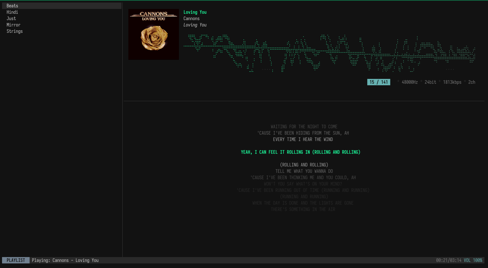
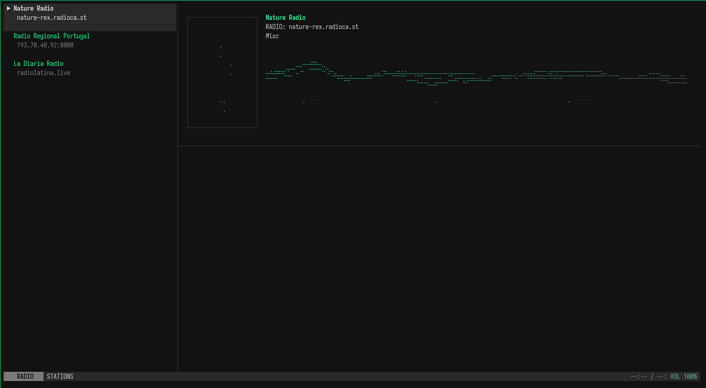

# Chord

**Chord** is a high-fidelity TUI music player for local audio files. It provides a clean, responsive interface for browsing and playing your music library.




## What it does

- **Local Playback**: A TUI music player for FLAC, MP3, WAV, and more.
- **Indexing**: Scans local folders and maintains a database for track access.
- **Album Art**: High-fidelity image preview in the TUI (requires a terminal with image support like Kitty, iTerm2, or WezTerm).
- **Metadata**: Shows technical specs (bitrate, sample rate, etc.) and lyrics from files.
- **Visualizer**: Real-time high-density visualizer that reacts to playback.
- **Radio Mode**: Stream online radio stations (Ctrl+R). Cycle by country or search all stations.

<br clear="right"/>

## How it works

Just run the `chord` command. The app will automatically scan your `music_dir` for files, update its local cache (`library_cache.toml`), and open the TUI player for you to browse and play your music.

## Installation

```bash
chmod +x install.sh
./install.sh
```
Or use the `Makefile`:

- `make setup`: Install dependencies.
- `make build`: Build the player.
- `make test`: Run tests.
- `make lint`: Run linting.

## Configuration

Settings are in `~/.config/chord/config.toml`.

```toml
[library]
music_dir = "~/Music"
scan_at_startup = true

[format]
filename_format = "{artist}/{year} - {album}/{track}. {title}"

[audio]
device_name = "ALSA: Default"
volume = 1.0

[theme]
bg = "#121212"
fg = "#CCCCCC"
accent = "#1BFD9C"
accent_dim = "#66B2B2"
```

## License

GNU GPL v3. See [LICENSE](LICENSE).