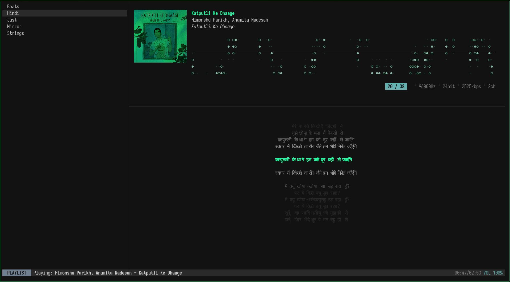

# Chord

A modern, fast, and minimalist terminal music player.

  
  
  

- **Nvim Style**: Minimalist TUI with Vim-like keybindings.
- **Complete Theme**: Beautiful, theme-aware interface.
- **Album Art**: Real-time procedural art and cover extraction.
- **Radio**: Global radio streaming out of the box.

## Quick Start
1. **Dependencies**: `alsa-lib` (Linux).
2. **Run**: `cargo run`.
3. **Radio**: `CTRL+R`.
4. **Search**: `/`.

## Keybindings
- `j/k` or `Arrows`: Navigate.
- `l/h`: Next/Previous track.
- `o/p`: Volume Down/Up.
- `Space`: Play/Pause.
- `/`: Search.
- `Tab`: Cycle views.
- `q`: Quit.

*See [KEYBINDINGS.md](./KEYBINDINGS.md) for more.*
